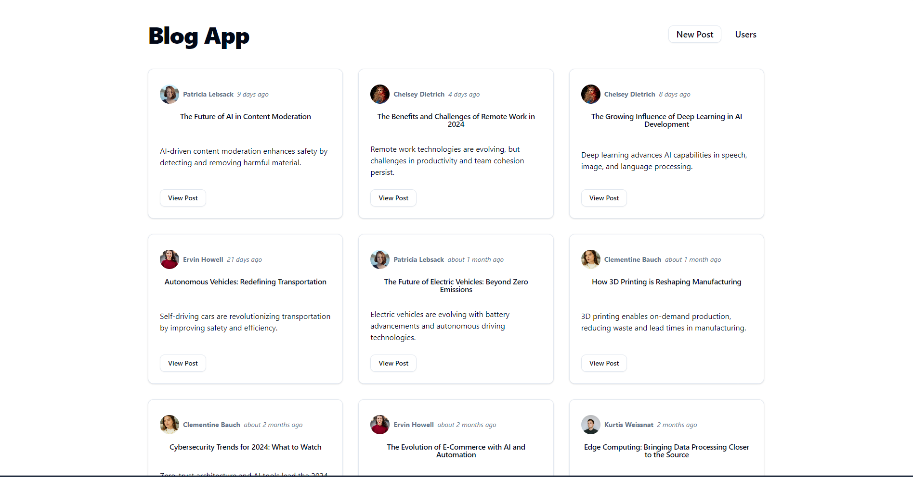

# Blog App

This is a blog application built using modern web development technologies. The app allows to create, read, update, and delete blog posts. The purpose of this project is to practice more and improve my coding skills.

## Table of contents

- [Blog App](#blog-app)
  - [Table of contents](#table-of-contents)
  - [Overview](#overview)
    - [Screenshot](#screenshot)
  - [My process](#my-process)
    - [Built with](#built-with)
    - [Prerequisites](#prerequisites)
    - [Installation](#installation)
    - [Continued development](#continued-development)
  - [Author](#author)


## Overview

### Screenshot



## My process

### Built with

- Semantic HTML5
- Flexbox & CSS Grid
- Mobile-first workflow
- RTK Query
- React Router
- [React](https://reactjs.org/) - JS library
- [ReactRouter](https://reactrouter.com/) - dynamic routing in React apps
- [ReduxToolkit](https://redux-toolkit.js.org/) - Redux toolset
- [TailwindCSS](https://tailwindcss.com) - For styles
- [shadcn/ui](https://ui.shadcn.com/) - Designed components


To get a local copy up and running, follow these simple steps.

### Prerequisites

- [Node.js](https://nodejs.org/) (Make sure you have Node.js installed)
- [Vite](https://vitejs.dev/) (for running the frontend)
- [json-server](https://github.com/typicode/json-server) (for running a mock backend API)


### Installation

1. **Clone the repository**

   ```bash
   git clone https://github.com/adriancretu03/blog-app.git
    ```

2. **Navigate to the project directory**

   ```bash
   cd blog-app
    ```

3. **Install dependencies**

   ```bash
   npm install
    ```

4. **Start the JSON Server**

   ```bash
   json-server --watch data/db.json --port 3000
    ```

5. **Start the Vite development server**

   ```bash
   npm run dev
    ```

6. **Open the app in your browser**

   Navigate to http://localhost:5173 in your web browser to see the app in action.


### What I learned

During this project, I had the opportunity to strengthen my skills in several areas:
1.  State Management with Redux Toolkit & `createEntityAdapter`:
    - I learned how to efficiently manage complex collections of data using Redux Toolkit's `createEntityAdapter`.The adapter helped normalize the state, meaning that data was stored as an object where each entity is accessed by its ID.

```js
const postsAdapter = createEntityAdapter({
  sortComparer: (a, b) => b.date.localeCompare(a.date),
});
const initialState = postsAdapter.getInitialState();
```

1. Working with Asynchronous Data in RTK Query:
    - I gained experience using RTK Query to efficiently fetch, cache, and update data from an API. This included defining queries for fetching posts, and mutations for adding, updating, and deleting posts.

```js
export const extendedApiSlice = apiSlice.injectEndpoints({
  endpoints: (builder) => ({
    getPosts: builder.query({
      query: () => "/posts",
      transformResponse: (responseData) => {
        const loadedPosts = responseData.map((post) => ({
          ...post,
          date: post?.date || new Date().toISOString(),
        }));
        return postsAdapter.setAll(initialState, loadedPosts);
      },
    }),
  }),
});
```

3. Dynamic UI Components with ShadCN:
    - ShadCN provided a flexible and accessible way to style the blog application. By using ShadCN components, I could quickly build responsive and user-friendly interfaces with minimal custom CSS.

### Continued development

As I move forward with future projects and continue improving this blog app, I plan to focus on the following areas:
1.  Performance Optimization.
2.  Advanced State Management.
3.  Authentication and Authorization.
4.  Backend Integration.

## Author

- Linkedin - [Adrian Cretu](https://www.linkedin.com/in/adriancretu03/)

